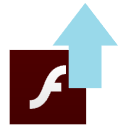

# Pull Up Flash Extension

The extension component of [Pull Up Flash](https://github.com/jamesgrams/pull-up-flash). You will need to install the main component of Pull Up Flash for this extension to work.

## Manual Setup

1. Download and extract this repo.
2. Open Chrome or your Chromium browser.
3. Navigate to `chrome://extensions`.
4. Enable Developer mode in the top right corner.
5. Click "Load unpacked" and select the extracted folder.

## Building

1. Have web-ext installed (`npm install -g web-ext`)
2. Run `web-ext build` in this directory.
3. Publish the resulting zip file.